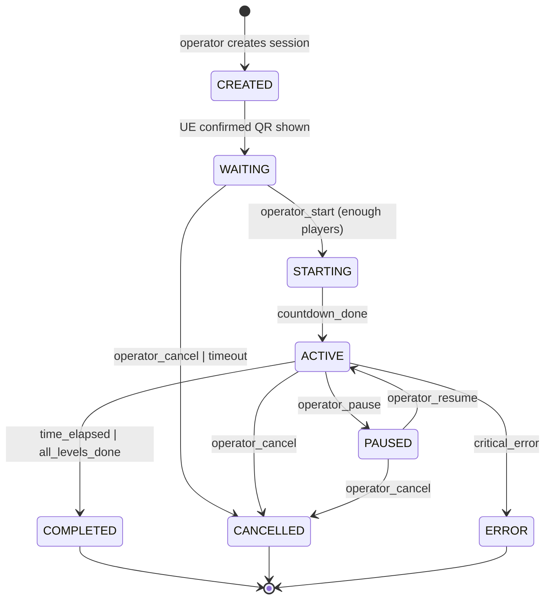

# OYNA Lasers × CRM — Integration Specification

> **Версия:** 1.0
> **Дата:** 2026-04-19
> **Статус:** Draft для согласования с backend-командой
> **Автор:** Azamat (engine side) + backend team review

---

## Table of Contents

1. [Overview](#1-overview)
2. [Current engine inventory](#2-current-engine-inventory)
3. [Domain model](#3-domain-model)
4. [Session lifecycle](#4-session-lifecycle)
5. [Protocol: UE ↔ Middleware (WebSocket)](#5-protocol-ue--middleware-websocket)
6. [Protocol: Middleware ↔ Backend (REST)](#6-protocol-middleware--backend-rest)
7. [Authentication & Security](#7-authentication--security)
8. [Offline mode & reliability](#8-offline-mode--reliability)
9. [Rating system](#9-rating-system)
10. [Balance & transactions](#10-balance--transactions)
11. [Required changes to engine](#11-required-changes-to-engine)
12. [Testing strategy](#12-testing-strategy)
13. [Deployment](#13-deployment)

---

## 1. Overview

### 1.1 Что такое OYNA Lasers

OYNA Lasers — сеть лазерных игровых комнат. Физически: помещение 5×8 метров с сеткой 8×6 лазерных лучей (48 штук). Игроки проходят комнату не задевая лучи. Три режима (Classic / Dynamic / Chaos), 10 уровней каждый.

Стартовый город: Алматы. Планируется 4 точки (venues). В каждой точке от 1 до нескольких комнат (stations).

### 1.2 Стейкхолдеры

| Роль | Устройство | Что делает |
|------|-----------|------------|
| **Игрок** | Собственный телефон | Регистрируется на oyna.pro, сканирует QR, играет, смотрит рейтинг |
| **Оператор** | Планшет / ПК на ресепшн | Принимает оплату, пополняет баланс игрока минутами |
| **Админ** | ПК в офисе | Управляет venues, stations, видит статистику |
| **UE (игровой клиент)** | Ноутбук оператора в комнате | Показывает игру, QR, принимает события от железа |
| **Middleware (Room Agent)** | Тот же ноутбук, Python | Мост между UE, железом и backend |
| **Backend (CRM)** | Облако | Хранит users, sessions, matches, rating |

### 1.3 Архитектура

```
┌─────────────────────────────────────────────────────────────────┐
│  WebClient (oyna.pro)                                           │
│  ├─ Лендинг / регистрация                                       │
│  ├─ /join/{joinCode} ← телефон игрока после скана QR            │
│  ├─ Личный кабинет игрока (баланс, рейтинг, история)            │
│  ├─ Админка операторов (пополнение баланса, создание сессий)    │
│  └─ Leaderboard экраны (TV в каждой точке)                      │
└───────────────────────────┬─────────────────────────────────────┘
                            │  HTTPS + WebSocket
                            ▼
┌─────────────────────────────────────────────────────────────────┐
│  Backend CRM (NestJS + PostgreSQL + Prisma)                     │
│  ├─ /api/v1/auth        — регистрация, логин                    │
│  ├─ /api/v1/users       — профили, баланс                       │
│  ├─ /api/v1/sessions    — создание/управление сессиями          │
│  ├─ /api/v1/matches     — результаты матчей от UE               │
│  ├─ /api/v1/rating      — агрегации (day/month/all-time)        │
│  ├─ /api/v1/venues      — точки, комнаты                        │
│  ├─ /api/v1/transactions— пополнения/списания баланса           │
│  └─ /api/v1/agents      — heartbeat от Room Agents              │
└───────────────────────────┬─────────────────────────────────────┘
                            │  HTTPS REST (API key + session token)
                            ▼
┌─────────────────────────────────────────────────────────────────┐
│  Room Agent (Python FastAPI, порт 8080, Windows ноутбук)        │
│                                                                 │
│  Существующая часть:                                            │
│  ├─ UART/RS-232 работа с контроллером лазеров                   │
│  ├─ WebSocket сервер ws://localhost:8080/ws/laser               │
│  └─ Проксирует события hardware → UE                            │
│                                                                 │
│  НОВАЯ часть (эта интеграция):                                  │
│  ├─ HTTP клиент к backend CRM                                   │
│  ├─ Хранит API key + station config в .env                      │
│  ├─ Буферизация offline событий (SQLite)                        │
│  ├─ Retry + exponential backoff                                 │
│  └─ Получает команды от backend и проксирует в UE               │
└───────────────────────────┬─────────────────────────────────────┘
                            │  WebSocket JSON (локально)
                            ▼
┌─────────────────────────────────────────────────────────────────┐
│  Unreal Engine 5.5 (C++ game client)                            │
│  ├─ AOLMain — главный актор (OLMain.cpp)                        │
│  ├─ UOLDriverWSClient — WS клиент (существующий)                │
│  ├─ Игровая логика (Classic/Dynamic/Chaos)                      │
│  ├─ HUD и UI                                                    │
│  └─ НЕ знает о userId, балансе, рейтинге                        │
│     Только: sessionId, slots, players[], scores                 │
└─────────────────────────────────────────────────────────────────┘
```

### 1.4 Ключевые архитектурные решения

| Решение | Обоснование |
|---------|-------------|
| **UE не делает HTTP напрямую** | Middleware уже работает с UE по WebSocket (`ws://localhost:8080/ws/laser`). Новый канал не нужен — расширяем существующий. |
| **Room Agent — единственная точка связи с backend** | Секреты (API keys) живут в `.env` на ноутбуке, не попадают в UE билд. Ретраи и offline buffer — в одном месте. |
| **UE — "тупой клиент"** | Не знает userId, баланс, рейтинг. Получает `sessionId` + `players[]`, шлёт результаты. Вся бизнес-логика на backend. |
| **Session триггерит оператор, не игрок** | Игрок платит на ресепшн, получает минуты на баланс, идёт в комнату. Оператор через админку (или прямо в UE) создаёт сессию. Игроки сканируют QR на мониторе комнаты и джойнятся. |
| **Идемпотентность match-completed** | Критично: повторная отправка результата не должна засчитать очки дважды. Backend дедупит по `(sessionId, level, attemptNumber)`. |

### 1.5 Scope этого документа

**Входит:**
- Протокол UE ↔ Middleware (WebSocket JSON)
- Протокол Middleware ↔ Backend (REST)
- Domain model (User, Session, Match, Transaction, Rating)
- Session lifecycle
- Auth + security
- Offline mode
- Что дописать в движке

**Не входит:**
- UI/UX oyna.pro (это отдельный дизайн)
- QR join flow на мобильном (backend решает)
- Payment gateway для пополнений (есть отдельный модуль)
- Внутренняя логика рендеринга в UE (это уже готово)

---

## 2. Current engine inventory

### 2.1 Что ЕСТЬ в UE коде (по результатам инвентаризации)

| Компонент | Файл:строка | Статус |
|-----------|-------------|--------|
| `AOLMain` (главный координатор) | `Public/Systems/OLMain.h` | ✅ работает |
| 8 multicast-делегатов для HUD | `OLMain.h:68-75, 118-141` | ✅ работает |
| `FOLLevelResult` struct | `OLMain.h:35-66` | ✅ работает |
| `EOLGameMode` enum (None/Classic/Dynamic/Chaos) | `OLMain.h` | ✅ работает |
| `EOLGameState` enum (Idle/WaitingStart/Countdown/Playing/LevelEnded) | `OLMain.h:28-33` | ⚠ Countdown объявлен, но не используется |
| `UOLDriverWSClient` (WebSocket) | `Public/CMD/OLDriverWSClient.h` | ✅ работает |
| Подключение к `ws://localhost:8080/ws/laser` | `OLDriverWSClient.cpp:12`, `OLMain.cpp:219-227` | ✅ работает |
| JSON приёмник (incoming events) | `OLMain.cpp:586, 601` | ✅ работает |
| `SendMessage` метод в WS клиенте | `UOLDriverWSClient::SendMessage` | ⚠ **существует, но нигде не вызывается** |
| HTTP модуль | `Build.cs:14` | ⚠ подключён, но не используется |
| JSON, JsonUtilities, WebSockets модули | `Build.cs` | ✅ подключены |
| Cheat-команды для тестирования | `OLCheatManager.cpp` | ✅ работает |

### 2.2 Чего НЕТ в UE коде (критичные пробелы для CRM)

| Чего нет | Последствие |
|----------|-------------|
| `sessionId`, `sessionToken` | Нечем идентифицировать текущую игровую сессию в backend |
| `playerId`, `userId` | Игра анонимная, нет понятия "кто играет" |
| `slots` concept | Мультиплеер до 6 игроков невозможен без слотов |
| `roomId`, `venueId`, `stationId` | Нечем идентифицировать комнату/точку |
| `BuildVersion` | Backend не знает какая версия игры запущена |
| Session timer (10 минут) | Сейчас только уровневый таймер |
| Пауза (`bPaused`, `PauseSession`, `ResumeSession`) | Оператор не может приостановить игру |
| `SessionResults[]` aggregation | Нет способа собрать все уровни за сессию в один пакет |
| Outgoing WS messages к backend | `SendMessage` есть, но никто не шлёт |
| `Config/DefaultGame.ini` OYNA-специфика | Нет конфига станции (RoomId, VenueId и т.д.) |

### 2.3 Известные баги в текущем коде

Обнаружены при инвентаризации — backend должен знать что **доверять FOLLevelResult из Dynamic/Chaos полностью нельзя**:

| Баг | Файл:строка | Что не так |
|-----|-------------|------------|
| `Dynamic.TimeUsed = TimeRemaining` | `OLMain.cpp:1020` | Должно быть `LevelDuration - TimeRemaining` |
| `Dynamic.TimeBonus` не заполняется | `OLMain.cpp:1020` | Всегда 0 |
| `Chaos.TimeUsed = TimeRemaining` | `OLMain.cpp:1184` | Аналогичный баг |
| `Chaos.TimeBonus` не заполняется | `OLMain.cpp:1184` | Всегда 0 |
| `Classic.TimeUsed / TimeBonus` | `OLMain.cpp:858-860` | ✅ корректно |
| Авто-переход уровней | только `OLMain.cpp:868-884` (Classic) | В Dynamic/Chaos — нет авто-next |

Backend-команде: при расчёте рейтинга учитывайте что `TimeBonus` из Dynamic/Chaos не валидно. Или используйте `FinalScore` (он считается правильно через `Lives*500 + floor(TimeRemaining)*10` во всех режимах).

---

## 3. Domain model

### 3.1 Entity-Relationship диаграмма

```
┌────────────┐       ┌────────────┐       ┌────────────┐
│   Venue    │←──────│  Station   │──→1   │   Room     │
│ (город)    │   1:N │  (ноутбук) │   1:1 │ (комната)  │
└────────────┘       └────────────┘       └────────────┘
                           │
                           │ 1:N
                           ▼
┌────────────┐       ┌────────────┐       ┌────────────┐
│    User    │←──M:N─│  Session   │──1:N─→│   Match    │
│ (игрок)    │       │ (10 минут) │       │(1 уровень) │
└────────────┘       └────────────┘       └────────────┘
    │   │                  │
    │   │                  │ 1:N
    │   │                  ▼
    │   │            ┌────────────┐
    │   │            │MatchPlayer │ (slot → userId mapping)
    │   │            └────────────┘
    │   │
    │   └──1:N──→┌──────────────┐
    │           │ Transaction  │ (пополнения/списания)
    │           └──────────────┘
    │
    └──1:1──→┌──────────────┐
            │   Rating     │ (all_time / monthly / daily)
            └──────────────┘
```

### 3.2 Ключевые сущности

**Venue** — точка (физический адрес OYNA)
```
id: uuid
name: "OYNA Алматы Достык"
city: "Almaty"
address: "..."
timezone: "Asia/Almaty"
```

**Station** — конкретная игровая комната
```
id: uuid  (например "laser-matrix-01")
venueId: uuid FK → Venue
name: "Laser Matrix #1"
roomType: "laser_matrix" | "target_arena" | "led_grid" | "hide_seek"
apiKey: string (сгенерированный secret, хранится в .env станции)
isOnline: boolean (heartbeat)
lastSeenAt: timestamp
buildVersion: string
```

**User** — игрок
```
id: uuid
email: string UNIQUE
phone: string UNIQUE
displayName: string
passwordHash: string
balanceMinutes: int (денормализованный счётчик минут)
createdAt, lastLoginAt
isBlocked: boolean
```

**Session** — игровая сессия (10 минут в комнате)
```
id: uuid
stationId: uuid FK → Station
modeId: "classic" | "dynamic" | "chaos"
startLevel: int (1-10)
sessionToken: string (secret для UE ↔ backend)
joinCode: string (короткий код, например "7AB-KZ9", для QR)
qrImageUrl: string (pre-generated QR picture)
status: enum (см. §4)
playersCount: int (1-6)
durationSeconds: int (по умолчанию 600 = 10 минут)
createdAt
waitingSince: timestamp (когда показан QR)
startedAt: timestamp (когда началась игра)
endedAt: timestamp
endReason: "time_elapsed" | "cancelled" | "error" | "completed_all"
totalScore: int (сумма по matches)
createdByOperatorId: uuid FK → User (оператор)
```

**MatchPlayer** (через-таблица Session ↔ User)
```
id: uuid
sessionId FK
userId FK
slot: int (0-5)
displayName: string (snapshot)
color: hex (slot color)
joinedAt: timestamp
```

**Match** — один уровень внутри сессии
```
id: uuid
sessionId FK
level: int (1-10)
attemptNumber: int (если игрок перепрохошёл)
startedAt, endedAt
durationSeconds: int
finalScore: int
livesLeft: int
bVictory: boolean
failReason: "time_out" | "lives_lost" | "session_ended" | null
rawResult: jsonb (FOLLevelResult полностью, для дебага)
```

**Transaction** — пополнения и списания баланса
```
id: uuid
userId FK
type: "topup" | "deduction" | "refund"
amountMinutes: int (положительное)
priceAmount: decimal (для topup, в тенге)
paymentMethod: "cash" | "card" | "online"
balanceAfter: int
sessionId FK (для deduction)
operatorId FK → User (для topup)
venueId FK (для topup)
createdAt
notes: string
```

**Rating** — денормализованные счётчики рейтинга
```
userId FK (primary key)
allTimePoints: int
monthlyPoints: int (обнуляется 1-го числа)
dailyPoints: int (обнуляется в 00:00 локального времени)
gamesPlayed: int
lastGameAt
updatedAt
```

### 3.3 Business rules

1. **Balance rule:** Пополнение и списание — только через `Transaction`. Никаких прямых UPDATE `user.balanceMinutes`. Триггер обновляет денормализованное поле при создании транзакции.
2. **Session duration:** 10 минут wall-clock time с момента `status=ACTIVE`. Пауза прибавляет время (не тратит).
3. **Players identification:** Игрок доджен быть зарегистрирован. Анонимной игры нет. (MVP возможно разрешить "гостевую игру" — требует отдельного решения).
4. **Shared lives:** Один лазер задел = все игроки теряют жизнь. Жизни общие для всей команды.
5. **Rating:** Рассчитывается по окончании сессии (не матча). Все игроки получают одинаковые очки (shared-lives следствие).
6. **Idempotency:** `match-completed` с одним и тем же `(sessionId, level, attemptNumber)` не должен засчитываться дважды.
7. **Session timeout:** Если игра не стартовала за 10 минут после создания → `status=CANCELLED_BY_TIMEOUT`.

---

## 4. Session lifecycle

### 4.1 Состояния сессии

```
              ┌───────────┐
    create ─→ │  CREATED  │
              └─────┬─────┘
                    │ UE показывает QR
                    ▼
              ┌───────────┐
              │  WAITING  │ ← игроки сканируют, джойнятся
              └─────┬─────┘
           operator_start
                    ▼
              ┌───────────┐
              │  STARTING │ ← 3-секундный Countdown в UE
              └─────┬─────┘
          countdown_done
                    ▼
              ┌───────────┐
              │   ACTIVE  │ ←─┐ playing levels, sending matches
              └─┬───┬───┬─┘   │
                │   │   │     │
         pause  │   │   │ level_complete/fail
                ▼   │   │     │
              ┌───────────┐   │
              │  PAUSED   │───┘ (resume)
              └───────────┘
                │   │   │
                │   │   └─→ time_elapsed (10 min up)
                │   │   └─→ all_levels_done
                │   └─→ operator_cancel
                └─→ error
                    ▼
              ┌───────────┐
              │ COMPLETED │ / CANCELLED / ERROR
              └───────────┘
                    │
                    ▼
          rating recalculated
          session-ended sent once
```

### 4.2 State mapping UE ↔ Backend

| Backend status | UE `EOLGameState` | Описание |
|----------------|-------------------|----------|
| `CREATED` | `Idle` | Сессия создана, UE получил команду показать QR |
| `WAITING` | `Idle` | QR на экране, ждём игроков |
| `STARTING` | `Countdown` | Оператор нажал "старт", UE показывает 3-2-1 |
| `ACTIVE` | `Playing` / `WaitingStart` / `LevelEnded` | Идёт игра, возможны переходы между уровнями |
| `PAUSED` | `Paused` **(новое состояние!)** | Игра приостановлена |
| `COMPLETED` | `Idle` | Сессия закончилась штатно (10 минут или все уровни) |
| `CANCELLED` | `Idle` | Оператор прервал |
| `ERROR` | `Idle` | Какая-то критичная ошибка |

**Важно:** нужно добавить `EOLGameState::Paused` в enum (`Public/Systems/OLMain.h`).

### 4.3 Time semantics

- **Session time** = wall clock time с момента `ACTIVE`. Пауза не тратит.
- **Level time** = per-level timer (90 секунд по умолчанию, зависит от уровня).
- **Session time > Level time:** если сессия кончилась в середине уровня — уровень засчитывается как `failReason=session_ended`, `bVictory=false`, `finalScore=0`.

Backend хранит:
- `session.durationSeconds = 600`
- `session.startedAt` (когда перешла в ACTIVE)
- `session.endedAt` (когда перешла в COMPLETED/CANCELLED)
- **Реальная длительность:** `endedAt - startedAt - sum(pauses)` = ~600 секунд в happy path.

### 4.4 Transitions



---

## 5. Protocol: UE ↔ Middleware (WebSocket)

### 5.1 Общие принципы

- **Транспорт:** существующий WebSocket `ws://localhost:8080/ws/laser`
- **Формат:** JSON, всегда есть поле `type` + `payload`
- **Идентификация:** UE получает `sessionId` от backend и включает его в каждое исходящее сообщение
- **Направление:** `backend→UE` (commands, incoming) и `UE→backend` (events, outgoing)

### 5.2 Incoming (backend → middleware → UE)

#### `session_created`
Backend создал сессию, UE должен показать QR.

```json
{
  "type": "session_created",
  "payload": {
    "sessionId": "sess_8f3a2c1d-...",
    "sessionToken": "tok_9K7xP...",
    "stationId": "laser-matrix-01",
    "mode": "classic",
    "startLevel": 1,
    "maxPlayers": 6,
    "joinCode": "7AB-KZ9",
    "qrImageUrl": "https://api.oyna.pro/v1/qr/7AB-KZ9.png",
    "waitingTimeoutSeconds": 600
  }
}
```

#### `player_joined`
Игрок отсканировал QR и был добавлен backend'ом в сессию.

```json
{
  "type": "player_joined",
  "payload": {
    "sessionId": "sess_8f3a2c1d-...",
    "slot": 0,
    "userId": "user_1234...",
    "displayName": "Aybar",
    "color": "#FF3355",
    "joinedAt": "2026-04-19T15:32:18Z"
  }
}
```

#### `session_start`
Оператор нажал "Начать игру". UE запускает Countdown → Playing.

```json
{
  "type": "session_start",
  "payload": {
    "sessionId": "sess_8f3a2c1d-...",
    "countdownSeconds": 3,
    "players": [
      { "slot": 0, "userId": "user_1234...", "displayName": "Aybar", "color": "#FF3355" },
      { "slot": 1, "userId": "user_5678...", "displayName": "Alibek", "color": "#33FF88" }
    ]
  }
}
```

#### `session_pause` / `session_resume`
Оператор приостанавливает или возобновляет игру.

```json
{
  "type": "session_pause",
  "payload": { "sessionId": "sess_...", "reason": "operator_request" }
}
```

#### `session_cancel`
Оператор прервал сессию (в любом состоянии).

```json
{
  "type": "session_cancel",
  "payload": { "sessionId": "sess_...", "reason": "operator_request" }
}
```

### 5.3 Outgoing (UE → middleware → backend)

#### `qr_shown`
UE подтверждает что QR виден игрокам.

```json
{
  "type": "qr_shown",
  "payload": {
    "sessionId": "sess_...",
    "sessionToken": "tok_...",
    "shownAt": "2026-04-19T15:30:00Z"
  }
}
```

#### `countdown_started`
UE начал Countdown анимацию.

```json
{
  "type": "countdown_started",
  "payload": {
    "sessionId": "sess_...",
    "countdownSeconds": 3
  }
}
```

#### `match_started`
Начался очередной уровень (внутри сессии).

```json
{
  "type": "match_started",
  "payload": {
    "sessionId": "sess_...",
    "sessionToken": "tok_...",
    "level": 1,
    "attemptNumber": 1,
    "startedAt": "2026-04-19T15:30:03Z",
    "levelConfig": {
      "lasersCount": 8,
      "durationSeconds": 90
    }
  }
}
```

#### `match_completed` ⭐ КРИТИЧНО
Один уровень закончен. Обязательно идемпотентно.

```json
{
  "type": "match_completed",
  "payload": {
    "sessionId": "sess_...",
    "sessionToken": "tok_...",
    "level": 1,
    "attemptNumber": 1,
    "completedAt": "2026-04-19T15:31:48Z",
    "durationSeconds": 105,
    "result": {
      "finalScore": 1920,
      "livesLeft": 3,
      "livesBonus": 1500,
      "timeBonus": 420,
      "timeUsed": 42.0,
      "bVictory": true,
      "reason": "Уровень пройден",
      "mode": "classic"
    }
  }
}
```

**Идемпотентность:** backend дедупит по `(sessionId, level, attemptNumber)`. Если такой match уже есть — возвращает 200 OK, но не засчитывает заново.

#### `life_lost` (optional, для live-таймлайна)
Игрок задел лазер. Опционально, для live-наблюдателей.

```json
{
  "type": "life_lost",
  "payload": {
    "sessionId": "sess_...",
    "level": 1,
    "laserId": 23,
    "livesRemaining": 2,
    "at": "2026-04-19T15:30:45Z"
  }
}
```

#### `session_ended` ⭐ КРИТИЧНО
Вся сессия закончена. Идемпотентно. Триггерит расчёт рейтинга.

```json
{
  "type": "session_ended",
  "payload": {
    "sessionId": "sess_...",
    "sessionToken": "tok_...",
    "endedAt": "2026-04-19T15:40:00Z",
    "reason": "time_elapsed",
    "durationSeconds": 600,
    "matchesPlayed": 3,
    "matchesWon": 2,
    "totalScore": 4280,
    "matches": [
      { "level": 1, "attemptNumber": 1, "finalScore": 1920, "bVictory": true, "reason": "Уровень пройден" },
      { "level": 2, "attemptNumber": 1, "finalScore": 1500, "bVictory": true, "reason": "Уровень пройден" },
      { "level": 3, "attemptNumber": 1, "finalScore": 860,  "bVictory": false, "reason": "Время вышло" }
    ]
  }
}
```

#### `heartbeat`
Каждые 30 секунд. Подтверждение что UE жив.

```json
{
  "type": "heartbeat",
  "payload": {
    "stationId": "laser-matrix-01",
    "buildVersion": "1.0.0",
    "uptime": 3600,
    "currentSessionId": "sess_..." /* или null */
  }
}
```

### 5.4 Error handling

При невалидном сообщении middleware отвечает:

```json
{
  "type": "error",
  "payload": {
    "code": "INVALID_SESSION_TOKEN" | "UNKNOWN_SESSION" | "OUT_OF_ORDER" | "MALFORMED_JSON",
    "message": "human readable",
    "originalType": "match_completed"
  }
}
```

UE в случае `OUT_OF_ORDER` или `INVALID_SESSION_TOKEN` должен залогировать и попытаться восстановить состояние из `session_recovery` (см. §8).

---

## 6. Protocol: Middleware ↔ Backend (REST)

Middleware (Room Agent) делает HTTPS REST вызовы к Backend CRM. Backend никогда не обращается к middleware напрямую — только через push через WS (middleware держит постоянное WS-соединение с backend для команд).

### 6.1 Authentication

Все запросы от middleware к backend:
```
Authorization: Bearer <STATION_API_KEY>
X-Station-Id: laser-matrix-01
X-Build-Version: 1.0.0
Content-Type: application/json
```

`STATION_API_KEY` — уникальный для каждой станции, генерируется backend при регистрации станции, хранится в `.env` на ноутбуке, НЕ попадает в git.

### 6.2 Endpoints — обзор

Полная спека в `openapi.yaml`. Здесь — сводка.

| Метод | Endpoint | Назначение |
|-------|----------|------------|
| POST | `/api/v1/stations/{id}/heartbeat` | Регулярный heartbeat от middleware |
| POST | `/api/v1/sessions` | Создать сессию (от админки оператора) |
| GET  | `/api/v1/sessions/{id}` | Получить состояние сессии |
| POST | `/api/v1/sessions/{id}/confirm-qr-shown` | UE подтвердил что QR виден |
| POST | `/api/v1/sessions/{id}/start` | Оператор запускает игру |
| POST | `/api/v1/sessions/{id}/pause` | Пауза |
| POST | `/api/v1/sessions/{id}/resume` | Возобновить |
| POST | `/api/v1/sessions/{id}/cancel` | Отменить |
| POST | `/api/v1/sessions/{id}/matches` | Отправить результат матча |
| POST | `/api/v1/sessions/{id}/end` | Закончить сессию + триггерить расчёт рейтинга |
| GET  | `/api/v1/sessions/{id}/events` | (для middleware) long-polling или WS подписка на команды |
| POST | `/api/v1/users/{id}/join-session` | Игрок сканирует QR, заходит в сессию |
| GET  | `/api/v1/users/me` | Профиль игрока |
| GET  | `/api/v1/users/me/balance` | Баланс + история транзакций |
| POST | `/api/v1/admin/users/{id}/topup` | Пополнить баланс (оператор) |
| GET  | `/api/v1/rating/leaderboard` | Таблица лидеров (фильтры: venue, period) |
| GET  | `/api/v1/rating/users/{id}` | Рейтинг конкретного игрока |

### 6.3 Пример: полный цикл happy path

#### 1. Admin создаёт сессию (из oyna.pro/admin)

```http
POST /api/v1/sessions
Authorization: Bearer <ADMIN_SESSION_JWT>
Content-Type: application/json

{
  "stationId": "laser-matrix-01",
  "mode": "classic",
  "startLevel": 1,
  "maxPlayers": 6,
  "durationSeconds": 600
}
```

**Response 201:**
```json
{
  "sessionId": "sess_8f3a2c1d-...",
  "sessionToken": "tok_9K7xP...",
  "joinCode": "7AB-KZ9",
  "qrImageUrl": "https://api.oyna.pro/v1/qr/7AB-KZ9.png",
  "status": "CREATED",
  "expiresAt": "2026-04-19T16:32:00Z"
}
```

После создания backend **push'ит** это сообщение в middleware через WS, middleware проксирует UE:
```json
{ "type": "session_created", "payload": { ... } }
```

#### 2. UE показывает QR, подтверждает backend'у

UE → middleware:
```json
{ "type": "qr_shown", "payload": { "sessionId": "...", "sessionToken": "..." } }
```

Middleware → Backend:
```http
POST /api/v1/sessions/sess_.../confirm-qr-shown
Authorization: Bearer <STATION_API_KEY>

{ "shownAt": "2026-04-19T15:30:00Z" }
```

**Response 200:** `{ "status": "WAITING" }`

#### 3. Игрок сканирует QR → на телефоне открывается `/join/7AB-KZ9`

Web client (mobile) → Backend:
```http
POST /api/v1/users/me/join-session
Authorization: Bearer <USER_JWT>

{ "joinCode": "7AB-KZ9" }
```

**Response 200:**
```json
{
  "sessionId": "sess_...",
  "slot": 0,
  "balanceAfter": 10,
  "status": "joined"
}
```

**Response 402 Payment Required** (если balanceMinutes < 10):
```json
{ "error": "INSUFFICIENT_BALANCE", "balanceMinutes": 5, "required": 10 }
```

Backend push'ит в middleware:
```json
{ "type": "player_joined", "payload": { "slot": 0, "userId": "...", "displayName": "Aybar" } }
```

#### 4. Оператор нажимает "Начать"

```http
POST /api/v1/sessions/sess_.../start
Authorization: Bearer <ADMIN_SESSION_JWT>

{}
```

**Response 200:** `{ "status": "STARTING", "players": [...] }`

Backend push'ит UE:
```json
{ "type": "session_start", "payload": { "countdownSeconds": 3, "players": [...] } }
```

#### 5. UE играет уровень → отправляет результат

UE → middleware:
```json
{ "type": "match_completed", "payload": { "level": 1, "finalScore": 1920, "bVictory": true, ... } }
```

Middleware → Backend:
```http
POST /api/v1/sessions/sess_.../matches
Authorization: Bearer <STATION_API_KEY>
Idempotency-Key: sess_...-L1-A1

{
  "level": 1,
  "attemptNumber": 1,
  "startedAt": "...",
  "completedAt": "...",
  "durationSeconds": 105,
  "finalScore": 1920,
  "livesLeft": 3,
  "bVictory": true,
  "failReason": null,
  "rawResult": { /* FOLLevelResult full */ }
}
```

**Response 201 Created** (первый раз):
```json
{ "matchId": "match_...", "created": true }
```

**Response 200 OK** (повторный запрос с тем же Idempotency-Key):
```json
{ "matchId": "match_...", "created": false }
```

#### 6. Сессия закончилась (10 минут)

UE → middleware:
```json
{ "type": "session_ended", "payload": { "reason": "time_elapsed", "matchesPlayed": 3, ... } }
```

Middleware → Backend:
```http
POST /api/v1/sessions/sess_.../end
Authorization: Bearer <STATION_API_KEY>
Idempotency-Key: sess_...-end

{
  "endedAt": "2026-04-19T15:40:00Z",
  "reason": "time_elapsed",
  "durationSeconds": 600,
  "matchesPlayed": 3,
  "totalScore": 4280
}
```

**Response 200:**
```json
{
  "status": "COMPLETED",
  "ratingDelta": {
    "user_1234...": { "allTimePoints": 280, "monthlyPoints": 280, "dailyPoints": 280 },
    "user_5678...": { "allTimePoints": 280, "monthlyPoints": 280, "dailyPoints": 280 }
  }
}
```

---

## 7. Authentication & Security

### 7.1 Три типа токенов

| Токен | Владелец | Где хранится | Когда выдаётся |
|-------|----------|--------------|----------------|
| `STATION_API_KEY` | Middleware (Room Agent) | `.env` на ноутбуке | При регистрации станции админом (один раз) |
| `SESSION_TOKEN` | Middleware + UE | В runtime, не persist | При создании сессии |
| `USER_JWT` | Веб-клиент игрока | localStorage браузера | При логине на oyna.pro |

### 7.2 STATION_API_KEY

- Генерируется backend'ом при регистрации станции (админом)
- Формат: `station_live_<hex64>` например `station_live_a3f5c2d8...`
- Хранится только в `.env` на ноутбуке станции (файл `.env.example` см. в пакете)
- Используется во всех запросах middleware → backend
- **Никогда не попадает в UE билд, в git, в логи**
- Ротация: возможность в админке "Regenerate API key" (для компрометации)

### 7.3 SESSION_TOKEN

- Выдаётся backend'ом при создании сессии
- Формат: `tok_<random32>`
- UE использует в своих исходящих сообщениях (middleware прокидывает в backend)
- Живёт до окончания сессии
- Backend валидирует что `sessionToken` соответствует `sessionId`

### 7.4 USER_JWT

- Стандартный JWT (sub=userId, exp=7 дней)
- Выдаётся backend при логине/регистрации игрока
- Используется в запросах `web client → backend`
- Не передаётся в UE

### 7.5 Что UE НЕ ДЕЛАЕТ

❌ **UE не доверяет сообщениям от веб-клиентов.** Единственная "правда" — backend.
❌ **UE не принимает userId извне.** userId приходит только от backend через `player_joined`.
❌ **UE не знает finalize-логику рейтинга.** Просто шлёт результаты.
❌ **UE не пишет логи с чувствительными данными** (userId, email, phone — не логировать).

### 7.6 Security checklist

- [ ] HTTPS everywhere (backend)
- [ ] `.env` в `.gitignore`
- [ ] `STATION_API_KEY` не в логах
- [ ] Rate limiting на backend endpoints
- [ ] CORS policy для oyna.pro
- [ ] Valid JWT signing key ротация
- [ ] Idempotency keys для всех мутаций
- [ ] `sessionToken` проверяется при каждом запросе

---

## 8. Offline mode & reliability

### 8.1 Failure modes

| Что упало | Что происходит | Recovery |
|-----------|----------------|----------|
| UE → middleware WS connection | UE пытается reconnect 1s/2s/5s/10s backoff | UE локально продолжает играть (middleware и железо на одном ноуте) |
| Middleware crash | UE видит WS closed | Middleware auto-restart via systemd/Windows service |
| Middleware → backend internet | Middleware буферизует события в SQLite | Ретраим когда интернет вернётся |
| Backend unavailable | Middleware получает 5xx | Exponential backoff + буфер |
| Power off middleware | Session потеряна | При старте — middleware читает SQLite, досылает unsent events |

### 8.2 Offline buffer

Middleware хранит локально SQLite БД `agent_buffer.db`:

```sql
CREATE TABLE pending_events (
    id INTEGER PRIMARY KEY AUTOINCREMENT,
    session_id TEXT NOT NULL,
    event_type TEXT NOT NULL,
    idempotency_key TEXT UNIQUE NOT NULL,
    payload TEXT NOT NULL,  -- JSON
    created_at DATETIME DEFAULT CURRENT_TIMESTAMP,
    attempts INTEGER DEFAULT 0,
    last_attempt_at DATETIME,
    sent_at DATETIME NULL
);

CREATE INDEX idx_unsent ON pending_events(sent_at) WHERE sent_at IS NULL;
```

### 8.3 Send loop (pseudocode)

```python
async def send_loop():
    while True:
        events = db.query("SELECT * FROM pending_events WHERE sent_at IS NULL ORDER BY id LIMIT 10")
        for event in events:
            try:
                response = await http.post(
                    f"{BACKEND_URL}/api/v1/sessions/{event.session_id}/{event.endpoint}",
                    headers={
                        "Authorization": f"Bearer {STATION_API_KEY}",
                        "Idempotency-Key": event.idempotency_key
                    },
                    json=json.loads(event.payload),
                    timeout=10
                )
                if response.status_code < 300:
                    db.update(event.id, sent_at=now())
                elif response.status_code == 409:
                    # Already processed on backend (idempotency hit)
                    db.update(event.id, sent_at=now())
                else:
                    db.update(event.id, attempts=event.attempts+1, last_attempt_at=now())
            except NetworkError:
                await sleep(backoff(event.attempts))
                db.update(event.id, attempts=event.attempts+1)
        await sleep(1)
```

### 8.4 Idempotency keys

Формат: `{sessionId}-{event}-{seq}`
- `match_completed`: `sess_abc-L1-A1` (level 1, attempt 1)
- `session_ended`: `sess_abc-end`
- `heartbeat`: **без** idempotency (дубликаты безвредны)

Backend принимает повторные запросы с тем же `Idempotency-Key` → возвращает 200 + тот же response. Без изменения БД.

### 8.5 Session recovery

Если middleware рестартовал посреди активной сессии:

1. При старте middleware читает из SQLite `current_session` запись.
2. Если есть активная сессия — middleware запрашивает `GET /sessions/{id}` у backend.
3. Если backend говорит `status=ACTIVE` — middleware восстанавливает состояние, шлёт UE `session_recovery` event.
4. UE показывает operator'у: "Session recovered, continue?" с опциями Continue / Cancel.

---

## 9. Rating system

### 9.1 Концепция

Рейтинг — **per-user**. Три leaderboards:
- **All-time** — глобально за всё время
- **Monthly** — этот календарный месяц
- **Daily** — сегодня

Плюс фильтры:
- **Global** — все точки OYNA объединены
- **Per-venue** — только одна точка

### 9.2 Когда рейтинг обновляется

Только при `session-ended`. Не при `match-completed`.

**Причина:** shared-lives правило означает что результат **одной игры** — это итог по всей сессии, не по уровню.

### 9.3 Формула rating points

```
rating_points = total_score × mode_multiplier × level_bonus
```

Коэффициенты (черновик, можно настраивать):

| Mode | `mode_multiplier` | Обоснование |
|------|-------------------|-------------|
| Classic | 1.0 | Базовый |
| Dynamic | 1.3 | Сложнее |
| Chaos | 1.6 | Самый сложный |

`level_bonus` = 1.0 + 0.1 × (max_level_reached - 1), где max_level_reached — максимальный уровень за сессию на котором был `bVictory`.

Пример: Classic, играл 3 уровня, прошёл 2. total_score=3420. max_level_reached=2.
`rating_points = 3420 × 1.0 × (1.0 + 0.1) = 3762`

### 9.4 Distribution

Shared-lives = все игроки сессии получают **одинаковые** `rating_points`.

```sql
-- Pseudo
FOR EACH player IN session.players:
  INSERT INTO rating_events (userId, sessionId, points, createdAt, venueId)
    VALUES (player.userId, session.id, rating_points, NOW(), station.venueId);

  UPDATE user_rating
  SET allTimePoints = allTimePoints + rating_points,
      monthlyPoints = monthlyPoints + rating_points,
      dailyPoints = dailyPoints + rating_points,
      gamesPlayed = gamesPlayed + 1,
      lastGameAt = NOW()
  WHERE userId = player.userId;
END
```

### 9.5 Reset jobs

- **Daily reset:** cron `0 0 * * *` в TZ `Asia/Almaty` — `UPDATE user_rating SET dailyPoints = 0`
- **Monthly reset:** cron `0 0 1 * *` — `UPDATE user_rating SET monthlyPoints = 0`
- **History preserved:** перед reset сохраняем snapshot в `rating_history` для отображения "вчерашнего топа"

### 9.6 Leaderboard queries

```sql
-- Top 10 global all-time
SELECT u.id, u.displayName, r.allTimePoints
FROM user_rating r JOIN users u ON u.id = r.userId
ORDER BY r.allTimePoints DESC
LIMIT 10;

-- Top 10 per venue, daily
SELECT u.id, u.displayName, SUM(re.points) as venue_daily_points
FROM rating_events re
JOIN users u ON u.id = re.userId
WHERE re.venueId = 'almaty-downtown'
  AND re.createdAt >= CURRENT_DATE
GROUP BY u.id, u.displayName
ORDER BY venue_daily_points DESC
LIMIT 10;
```

### 9.7 TV leaderboard

Каждая точка имеет **TV экран** с живым рейтингом. Это отдельный экран oyna.pro:
- URL: `oyna.pro/tv/{venueId}`
- Обновление: WebSocket push от backend при обновлении рейтинга
- Fallback: polling каждые 5 секунд

---

## 10. Balance & transactions

### 10.1 Business flow

```
1. Игрок регистрируется на oyna.pro → balanceMinutes = 0
2. Приходит в точку, оплачивает на ресепшн
3. Оператор в админке: "Найти пользователя по номеру телефона"
4. Оператор: "Пополнить: 20 минут за 2000 тенге, cash"
5. Backend создаёт Transaction(type=topup, amount=20, price=2000, operatorId, venueId)
6. balanceMinutes += 20 (через триггер или в той же транзакции)
7. Игрок идёт в комнату, сканирует QR
8. Backend: проверяет balanceMinutes >= 10, создаёт Transaction(type=deduction, amount=10, sessionId)
9. balanceMinutes -= 10
10. Игрок играет 10 минут
```

### 10.2 Topup endpoint (для операторов)

```http
POST /api/v1/admin/users/{userId}/topup
Authorization: Bearer <OPERATOR_JWT>

{
  "amountMinutes": 20,
  "priceAmount": 2000,
  "paymentMethod": "cash",
  "notes": "Walk-in customer, 3 friends"
}
```

**Response 201:**
```json
{
  "transactionId": "trx_...",
  "balanceAfter": 30,
  "createdAt": "2026-04-19T15:00:00Z"
}
```

### 10.3 Deduction при join-session

Происходит внутри `POST /api/v1/users/me/join-session`:

```typescript
async joinSession(userId, joinCode) {
  return db.transaction(async (tx) => {
    const user = await tx.user.findUnique({ where: { id: userId }, lock: 'FOR UPDATE' });
    if (user.balanceMinutes < 10) {
      throw new Error('INSUFFICIENT_BALANCE');
    }
    const session = await tx.session.findUnique({ where: { joinCode } });
    if (session.status !== 'WAITING') {
      throw new Error('SESSION_NOT_AVAILABLE');
    }
    if (session.players.length >= session.maxPlayers) {
      throw new Error('SESSION_FULL');
    }

    const slot = findFreeSlot(session.players);

    await tx.matchPlayer.create({ sessionId, userId, slot, displayName: user.displayName });
    await tx.transaction.create({ userId, type: 'deduction', amountMinutes: 10, sessionId });
    await tx.user.update({ where: { id: userId }, data: { balanceMinutes: { decrement: 10 } } });

    // Push to middleware
    await pushToStation(session.stationId, {
      type: 'player_joined',
      payload: { sessionId, slot, userId, displayName: user.displayName }
    });

    return { sessionId, slot, balanceAfter: user.balanceMinutes - 10 };
  });
}
```

### 10.4 Refund policy

Если сессия была отменена (`CANCELLED`) — автоматический возврат минут всем присоединившимся игрокам:

```sql
-- При session cancellation
FOR EACH player IN session.players:
  INSERT INTO transaction(userId, type='refund', amountMinutes=10, sessionId, notes='Session cancelled');
  UPDATE user SET balanceMinutes = balanceMinutes + 10 WHERE id = player.userId;
END
```

### 10.5 Balance в UI

Игрок видит в личном кабинете:
- Текущий `balanceMinutes`
- Историю транзакций (20 последних)
- "Хватит ли на игру?" индикатор (зелёный/красный)

---

## 11. Required changes to engine

Полный список изменений в `RISKS.md`. Здесь — резюме.

### 11.1 Что добавить в AOLMain (`Public/Systems/OLMain.h`)

```cpp
// Session state
UPROPERTY() FString CurrentSessionId;
UPROPERTY() FString CurrentSessionToken;
UPROPERTY() TArray<FOLPlayerSlot> SessionPlayers;  // новая структура
UPROPERTY() float SessionTimeRemaining = 600.f;
UPROPERTY() float SessionDuration = 600.f;
UPROPERTY() int32 SessionMatchesPlayed = 0;
UPROPERTY() int32 SessionTotalScore = 0;
UPROPERTY() TArray<FOLLevelResult> SessionResults;

// Station config (из DefaultGame.ini)
UPROPERTY(Config) FString RoomId;
UPROPERTY(Config) FString VenueId;
UPROPERTY(Config) FString StationId;
UPROPERTY(Config) FString BuildVersion;

// Pause support
UPROPERTY() bool bPaused = false;

// New delegates
UPROPERTY(BlueprintAssignable) FOnOLSessionStarted OnSessionStarted;
UPROPERTY(BlueprintAssignable) FOnOLSessionEnded OnSessionEnded;
UPROPERTY(BlueprintAssignable) FOnOLSessionPaused OnSessionPaused;
UPROPERTY(BlueprintAssignable) FOnOLPlayerJoined OnPlayerJoined;

// New methods
void StartSession(const FString& SessionId, const FString& Token, const TArray<FOLPlayerSlot>& Players);
void EndSession(EOLSessionEndReason Reason);
void PauseSession();
void ResumeSession();
```

### 11.2 Новые enums

```cpp
UENUM(BlueprintType)
enum class EOLSessionEndReason : uint8 {
    TimeElapsed,
    OperatorCancelled,
    AllLevelsCompleted,
    NetworkError,
    Error
};

// Добавить в существующий EOLGameState:
enum class EOLGameState : uint8 {
    Idle,
    WaitingStart,
    Countdown,
    Playing,
    LevelEnded,
    Paused  // NEW
};
```

### 11.3 Новый struct

```cpp
USTRUCT(BlueprintType)
struct FOLPlayerSlot {
    GENERATED_BODY()

    UPROPERTY(BlueprintReadOnly) int32 Slot = -1;
    UPROPERTY(BlueprintReadOnly) FString UserId;
    UPROPERTY(BlueprintReadOnly) FString DisplayName;
    UPROPERTY(BlueprintReadOnly) FLinearColor Color;
};
```

### 11.4 Расширение UOLDriverWSClient

**Incoming handlers (новые):**
```cpp
void HandleSessionCreated(const TSharedPtr<FJsonObject>& Payload);
void HandlePlayerJoined(const TSharedPtr<FJsonObject>& Payload);
void HandleSessionStart(const TSharedPtr<FJsonObject>& Payload);
void HandleSessionPause(const TSharedPtr<FJsonObject>& Payload);
void HandleSessionResume(const TSharedPtr<FJsonObject>& Payload);
void HandleSessionCancel(const TSharedPtr<FJsonObject>& Payload);
```

**Outgoing senders (новые, используют существующий `SendMessage`):**
```cpp
void SendQrShown(const FString& SessionId);
void SendCountdownStarted(const FString& SessionId);
void SendMatchStarted(const FString& SessionId, int32 Level);
void SendMatchCompleted(const FString& SessionId, const FOLLevelResult& Result);
void SendSessionEnded(const FString& SessionId, EOLSessionEndReason Reason);
void SendHeartbeat();
void SendLifeLost(const FString& SessionId, int32 LaserId, int32 LivesRemaining);
```

### 11.5 Session timer в Tick

```cpp
void AOLMain::Tick(float DeltaTime) {
    Super::Tick(DeltaTime);

    if (bPaused) return;

    // Existing level timer logic...

    // NEW: Session timer
    if (!CurrentSessionId.IsEmpty() && CurrentState != EOLGameState::Idle) {
        SessionTimeRemaining -= DeltaTime;
        if (SessionTimeRemaining <= 0.f) {
            EndSession(EOLSessionEndReason::TimeElapsed);
        }
    }
}
```

### 11.6 Config/DefaultGame.ini — добавить секцию

```ini
[/Script/OYNA_Lasers.OLMain]
RoomId=laser-matrix-01
VenueId=almaty-downtown
StationId=station-001
BuildVersion=1.0.0
SessionDurationSeconds=600
HeartbeatIntervalSeconds=30
```

### 11.7 Баг-фиксы

Обязательно исправить перед CRM интеграцией:

- `OLMain.cpp:1020` (Dynamic): заменить `Result.TimeUsed = TimeRemaining` на `Result.TimeUsed = LevelDuration - TimeRemaining` + добавить `Result.TimeBonus = FMath::FloorToInt(TimeRemaining) * 10`
- `OLMain.cpp:1184` (Chaos): такой же фикс

### 11.8 Estimation

Разработка в UE:
- P0 (обязательно для MVP CRM): ~3-4 рабочих дня C++
- Баг-фиксы Dynamic/Chaos: ~1 час
- Session Summary widget (UMG): ~1 день (идёт параллельно с UI-разработчиком)
- Тестирование без backend (моки): ~1 день

**Итого:** 5-6 рабочих дней на engine side.

---

## 12. Testing strategy

### 12.1 Unit tests (backend)

- Идемпотентность `match-completed` и `session-ended`
- Валидация `sessionToken`
- Calculate rating points для всех режимов
- Balance deduction при join-session (edge cases: недостаточно, сессия full, уже в сессии)
- Refund при cancel

### 12.2 Integration tests (backend + middleware mock)

- Happy path: create session → join → start → play 3 levels → end → rating updated
- Operator cancel mid-session → refund
- Session timeout без join → auto-cancel
- Duplicate match-completed → no duplicate rating

### 12.3 E2E tests (с реальным UE через cheats)

UE cheat-команды уже существуют (`StartClassicLevel`, `SimulateLevelComplete` и т.д.). Добавить новые:

```
SimulateSessionStart <sessionId> <players_csv>
SimulateSessionEnd <reason>
SimulateSessionPause / Resume
```

### 12.4 Load testing

- 4 точки × 2 станции × сессии каждые 15 минут = ~30 сессий/час пик
- `match-completed` ~100/час пик
- Очень низкие нагрузки. Нормальный Postgres выдержит без оптимизаций.

### 12.5 Chaos testing

- Kill middleware в середине сессии → recovery
- Drop internet на 2 минуты → buffer + replay
- Duplicate events → idempotency проверка
- Backend 500 error → retry

---

## 13. Deployment

### 13.1 Environments

| Env | URL | Purpose |
|-----|-----|---------|
| dev | `https://dev-api.oyna.pro` | Разработка, ломать можно |
| staging | `https://staging-api.oyna.pro` | Pre-prod, тест с реальным железом |
| production | `https://api.oyna.pro` | Боевая |

### 13.2 Station setup checklist

Для каждой новой станции:

1. Backend: admin регистрирует станцию в админке → получает `STATION_API_KEY`
2. На ноутбуке станции: создать `.env` файл на основе `.env.example`
3. Установить middleware как Windows service (auto-start)
4. Настроить UE `Config/DefaultGame.ini` с `StationId`, `RoomId`, `VenueId`, `BuildVersion`
5. Первый запуск: heartbeat от middleware должен появиться в админке
6. Тестовая сессия: операторе создаёт → проверяет что UE показывает QR → сам сканирует → играет

### 13.3 Version compatibility

Поле `buildVersion` в heartbeat позволяет backend знать версию UE. На случай несовместимостей:
- Backend хранит `minSupportedBuildVersion` в конфиге
- Если станция шлёт старую версию — в ответе на heartbeat флаг `needsUpdate: true`
- В UI админки красный индикатор "Station needs update"

---

## Приложения

- **`openapi.yaml`** — полная REST спецификация (machine-readable)
- **`WS_PROTOCOL.md`** — подробный формат WebSocket сообщений
- **`BACKEND_SCHEMA.md`** — предложение схемы PostgreSQL
- **`RISKS.md`** — список что нужно доработать в движке с файл:строка ссылками
- **`.env.example`** — template конфига для станции
- **`diagrams/*.mmd`** — 5 Mermaid sequence диаграмм
- **`README.md`** — quick start для backend-команды
